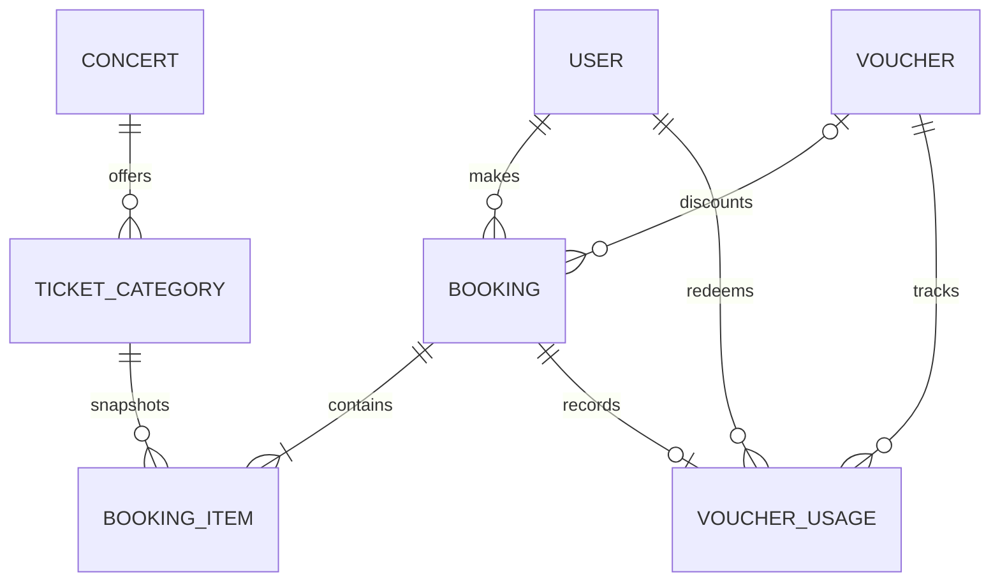

# Database design

## Entity relationship model



## Table responsibilities

| Table            | Responsibility and important fields                                            |
| ---------------- | ------------------------------------------------------------------------------ |
| `User`           | Login identity, bcrypt hash, and CUSTOMER/OPERATOR/ADMIN role                  |
| `Concert`        | Event metadata, start time, and DRAFT/PUBLISHED/SOLD_OUT/CANCELLED lifecycle   |
| `TicketCategory` | Per-concert category, price, total quantity, and available quantity            |
| `Booking`        | Customer reservation, idempotency key, status, voucher, and monetary snapshots |
| `BookingItem`    | Category/quantity with unit price frozen at booking time                       |
| `Voucher`        | Code, type/value, dates, capacity counter, minimum order, and discount cap     |
| `VoucherUsage`   | Proof that one user consumed one voucher for one booking                       |

UUID identifiers avoid exposing sequential volume and can be generated independently. API timestamps are ISO-8601.

## Integrity guarantees

| Constraint/invariant                                   | Protection                                             |
| ------------------------------------------------------ | ------------------------------------------------------ |
| `User.email` unique                                    | One account per normalized email                       |
| `Voucher.code` unique                                  | Unambiguous campaign lookup                            |
| `(Booking.userId, Booking.idempotencyKey)` unique      | Retried request creates at most one booking            |
| `(VoucherUsage.voucherId, VoucherUsage.userId)` unique | Customer cannot reuse a voucher                        |
| `VoucherUsage.bookingId` unique                        | One usage record per booking                           |
| Foreign keys                                           | No orphan items/usages/categories                      |
| Conditional inventory update                           | Availability cannot become negative through booking    |
| Conditional voucher update                             | `usedCount` cannot exceed `usageLimit` through booking |

Application validation gives readable errors; database constraints are the final concurrency protection.

## Money and historical snapshots

Money uses `Decimal(12,2)`, not JavaScript floating point. `subtotalAmount`, `discountAmount`, `totalAmount`, and each item's `unitPrice` are commercial snapshots, so later catalogue/voucher changes cannot rewrite booking history.

## Inventory model

`totalQuantity` is configured capacity and `availableQuantity` is immediately bookable capacity. Booking uses an atomic statement equivalent to:

```sql
UPDATE "TicketCategory"
SET "availableQuantity" = "availableQuantity" - :quantity
WHERE id = :id AND "availableQuantity" >= :quantity;
```

Affected-row count is the concurrency-safe decision. Preliminary reads support validation/pricing but do not reserve stock. Cancellation/expiry restores inventory inside the locked status transaction.

## Voucher model

Validity requires active status, campaign time, minimum order, and unused capacity. Percentage and fixed vouchers share one table; an optional cap limits percentage discounts. `VoucherUsage` separately enforces one use per customer under concurrency.

## Index analysis

| Index                      | Query supported                     |
| -------------------------- | ----------------------------------- |
| `Concert.status`           | Published catalogue filtering       |
| `Concert.startAt`          | Upcoming concert ordering/filtering |
| `TicketCategory.concertId` | Concert categories                  |
| `Booking.userId`           | Customer booking history            |
| `Booking.status`           | Operation status monitoring         |
| `Booking.createdAt`        | Newest-first operation listing      |

The design indexes demonstrated access paths without adding write cost to every column. Larger datasets may justify `(status, createdAt DESC)` after measuring query plans.

## Transaction boundaries

Booking creation includes inventory, voucher capacity, totals, items, and usage in one transaction. Any failure rolls back all work. Cancellation/expiry locks the booking row, validates transition, restores item quantities, and changes status in one transaction.

PostgreSQL is required for concurrency tests; mocked unit tests cannot prove these guarantees.

## Migration and seed strategy

Migration history is committed under `prisma/migrations`. A reviewer creates an empty database and runs `npx prisma migrate deploy`; schema push is unnecessary. `npm run prisma:seed` creates deterministic accounts, catalogue, and vouchers using repeatable behavior.

Backups, point-in-time recovery, online migration orchestration, archival/partitioning, and data-retention policy are production follow-ups.
