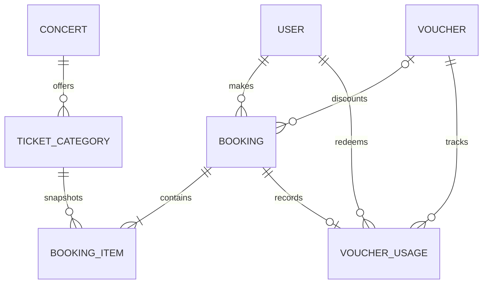

# Database design

Key guarantees are unique user/email, voucher/code, `(userId,idempotencyKey)`, `(voucherId,userId)`, and one usage per booking. Foreign keys preserve relationships. Status, created time, concert status/start, user bookings, and category/concert have targeted indexes.

Money uses `Decimal(12,2)`, never JavaScript floating point. Booking item unit price and booking subtotal/discount/total are commercial snapshots, so later catalogue changes cannot rewrite history.
