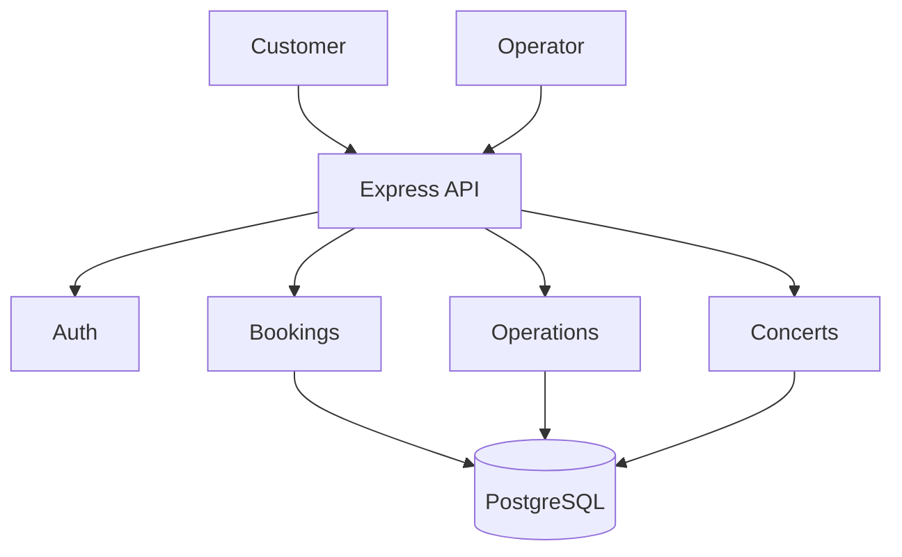

# System design

Customers browse and reserve inventory; operators administer catalogue data and booking state. A modular monolith keeps one deployable and one transaction boundary.

Routes translate HTTP, controllers coordinate responses, Zod validates boundaries, and services own business/database rules. Booking authenticates, validates the idempotency key, opens a transaction, resolves one concert, decrements sorted categories conditionally, reserves a voucher conditionally, writes snapshots/usages, and commits.

Peak traffic is about 5–8.3 requests/second. Consistency is harder than throughput, so PostgreSQL is more appropriate than distributed transactions. Future growth can add stateless replicas, connection pooling, cached catalogue reads, read replicas, rate limiting, and an extreme-spike waiting room.
