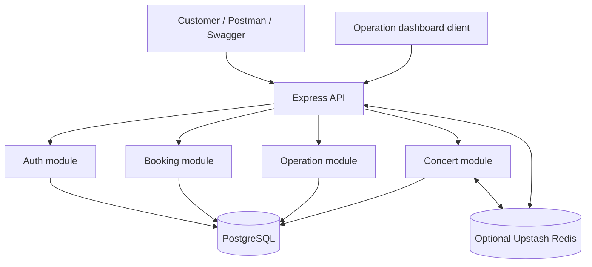
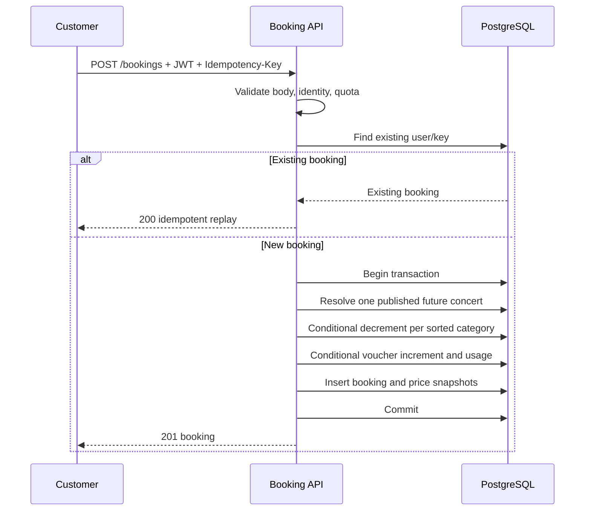
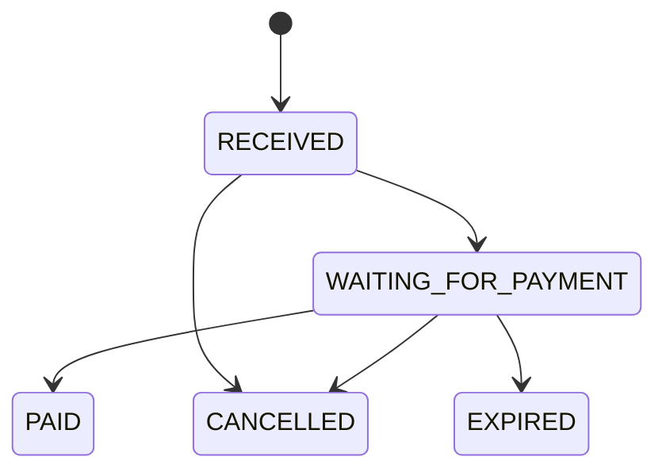

# System design

## Requirement analysis

The platform has two actors and two workload shapes:

- Customers browse a read-heavy public catalogue and submit correctness-sensitive bookings.
- Operators inspect bookings and administer concerts, availability, vouchers, and booking status.

The expected flash-sale peak is 300–500 booking requests per minute (about 5–8.3 requests/second). That rate is moderate for one API process and PostgreSQL instance, but requests may contend for the same limited ticket row and voucher. The design prioritizes consistency, deterministic failure, retry safety, and reviewer clarity over early microservice decomposition.

## Chosen architecture

A modular monolith provides one deployable API and one PostgreSQL transaction boundary:

Routes define HTTP and middleware, controllers shape responses, Zod validates boundaries, and services own business/database rules. This separation keeps features testable without adding network calls between internal modules.

### Why not microservices

Splitting inventory, vouchers, and bookings into separate services would turn one local transaction into distributed coordination. At the stated traffic, that adds operational and consistency risk without demonstrated need. Module boundaries still allow later extraction if scaling or team ownership requires it.

### Why PostgreSQL is the source of truth

PostgreSQL provides ACID transactions, conditional updates, unique constraints, and row locking. These directly protect the brief's business risks. Redis is not the inventory authority and is not required for booking correctness.

### Why optional Upstash Redis

- Published concert responses are cached for 30 seconds to reduce repeated reads.
- Authentication and booking quotas are shared across stateless API instances.
- Missing credentials disable Redis cleanly for local review.
- Redis errors fail open: catalogue reads use PostgreSQL and requests proceed without distributed quota enforcement.

Fail-open favors booking availability for this assignment. Production could add gateway/WAF fallback protection during an abuse event.

## Booking write flow

Zero affected inventory rows returns a business conflict and rolls back the transaction. The unique idempotency constraint handles simultaneous first attempts even if both miss the early lookup.

## Operation workflow and state model

Operators monitor bookings, inspect details, filter a simple suspicious heuristic, create/publish concerts, inspect availability, create/list vouchers, and apply allowed status changes.

`PAID`, `CANCELLED`, and `EXPIRED` are terminal. Cancellation/expiry locks the booking row, restores inventory, and changes status in one transaction, preventing double restoration.

## Security boundaries

- bcrypt password hashes and signed JWTs.
- Customer queries filtered by authenticated `userId`.
- OPERATOR/ADMIN RBAC for internal routes.
- Zod validation for body/path/query/header input.
- Helmet, CORS, JSON size limit, and distributed quotas.
- Secrets kept in `.env` or managed deployment secrets, never Git.

Refresh rotation, recovery, WAF, audit history, and production secret management are out of scope.

## Failure behavior

| Failure                          | Behavior                                                     |
| -------------------------------- | ------------------------------------------------------------ |
| Insufficient inventory           | Roll back and return `409`                                   |
| Voucher exhausted/reused/invalid | Roll back and return a business/validation error             |
| Duplicate retry                  | Return existing booking without a second decrement           |
| Concurrent cancellation          | Row lock and terminal state prevent double restoration       |
| Upstash unavailable              | Fall back to PostgreSQL; quota fails open and logs a warning |
| PostgreSQL unavailable           | Fail the request; never report a false booking success       |
| Unexpected exception             | Structured server log and generic `500` response             |

## Scaling path

1. Add production metrics/tracing, connection pooling, and alerts.
2. Run stateless API replicas behind a load balancer; Upstash quota remains shared.
3. Add read replicas/cache refinement for catalogue and reporting.
4. Add a queue for notifications and non-transactional side effects.
5. Add waiting-room admission control for extreme spikes.
6. Extract a module only when scaling, ownership, or deployment justifies distributed complexity.

## Key trade-offs

- Cached availability may be stale for 30 seconds, but booking revalidates PostgreSQL atomically.
- Rate limiting controls obvious spam but is not a complete bot/WAF strategy.
- Inventory is reserved immediately; automated unpaid-hold expiry is not implemented.
- Manual payment status demonstrates a state machine without pretending a payment gateway exists.
